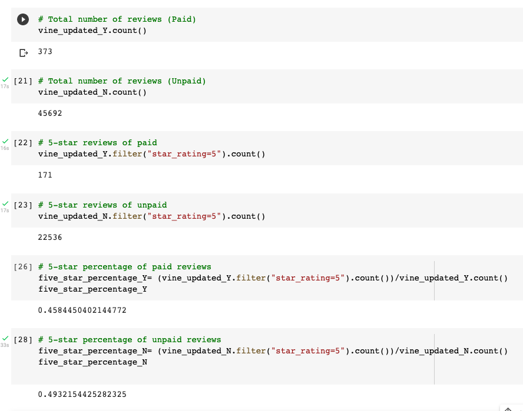

# Amazon_Vine_Analysis

https://s3.amazonaws.com/amazon-reviews-pds/tsv/index.txt

https://s3.amazonaws.com/amazon-reviews-pds/tsv/amazon_reviews_us_Lawn_and_Garden_v1_00.tsv.gz

## Determine Bias of Vine Reviews

The report should contain the following:

Overview of the analysis: Explain the purpose of this analysis.

Results: Using bulleted lists and images of DataFrames as support, address the following questions:

How many Vine reviews and non-Vine reviews were there?
How many Vine reviews were 5 stars? How many non-Vine reviews were 5 stars?
What percentage of Vine reviews were 5 stars? What percentage of non-Vine reviews were 5 stars?

Summary: In your summary, state if there is any positivity bias for reviews in the Vine program. Use the results of your analysis to support your statement. Then, provide one additional analysis that you could do with the dataset to support your statement.